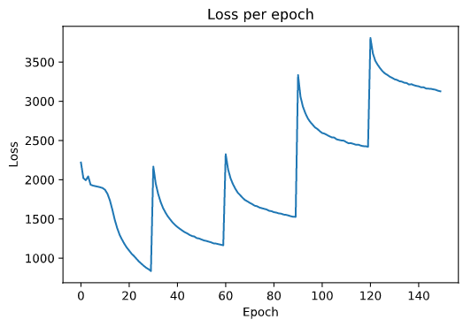

## Environment Dependencies
My agent requires Python 3.5 and Stockfish installed on the system. For Linux systems, my scripts expect Stockfish to be installed to `/usr/games/stockfish`

Library dependencies can be installed with

```
pip install -r requirements.txt
```

## Datasets

The results of my simulation games are in the `training_data_k` folder.


## Model Training Using PyTorch

Model training can be performed by running the `Training Lob.ipynb`. This log also contains the runtime data and number of files analyzed from my runs.



## Pretrained models
Pretrained models can be unzipped from `old-nnet-models`.

## Simulation Games

Training (simulation) games can be performed by running this bash command

```
python training_game_self_cpu.py [start iter] [end iter]
```
where start and end iter are numbers to help with file saving.

## Evaluation Games

Evaluation games were run using the `versus_*.py` files, from the perspective of using the AlphaZero agent as the white player or black player. The bash command for these python scripts is:

```
python versus_random_[color]-[model].py [start iter] [end iter] [winnerlog.txt]
```
